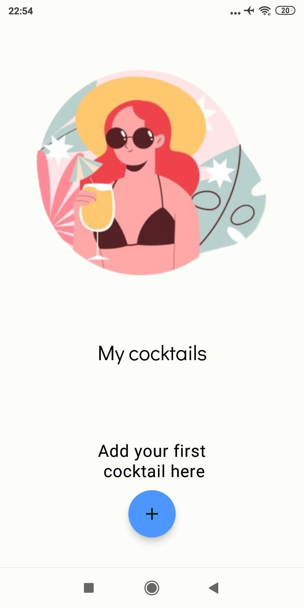
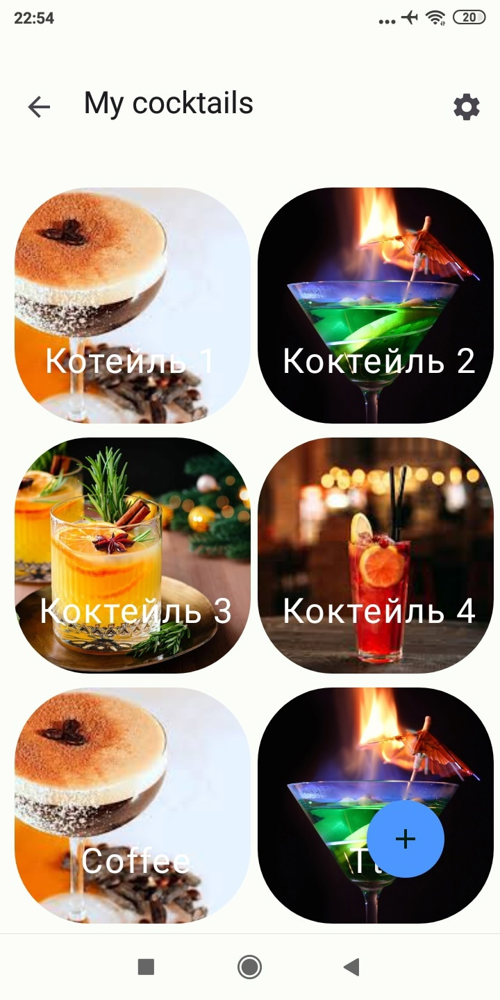
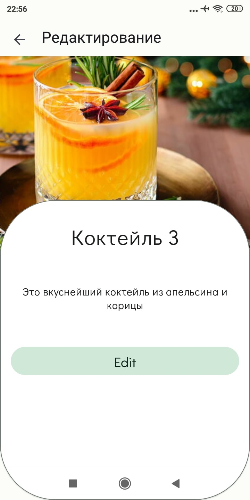
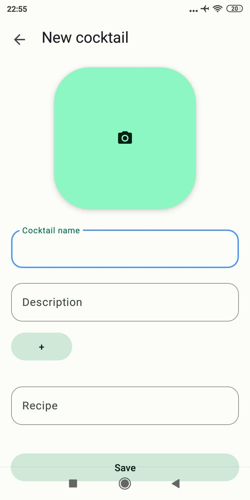
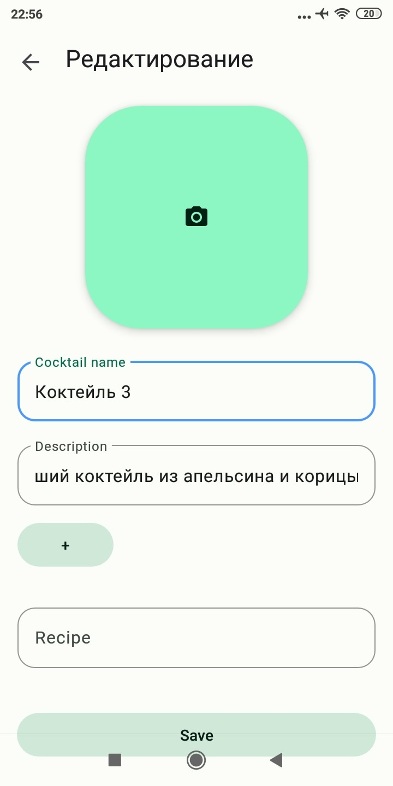
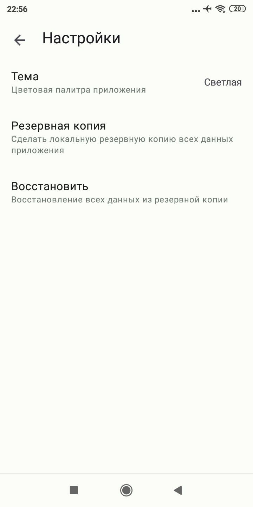
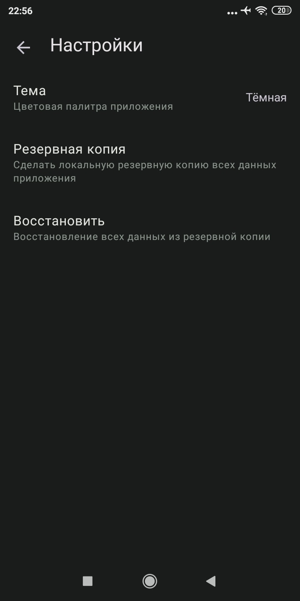
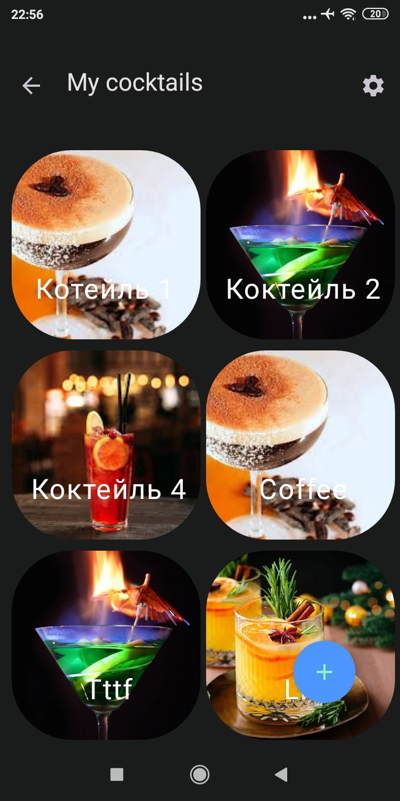

# Wretches

Cocktail bar - приложение с рецептами коктейлей.
Здесь можно добавлять, просматривать детально и редактировать коктейли и их рецепты.

Основная цель приложения - отработать навыки использования и работы с файловым хранилищем в Android.
Используются следующие способы хранения данных на устройстве:
- Работа с базами данных (Room)
- Работа с Shared Preferences через Jetpack DataStore
- Работа с внутренним хранилищем приложения

## Дополнительно

Также реализовано:
- Поддержка концепции edge-to-edge;
- Светалая и тёмная темы

## Скриншоты

### Главный экран, экран со списком добавленных коктейлей 

 

### Экран с детальным просмотром коктейля

### Создание/редактирование коктейля

 

### Настройки и темы приложения

  ****
